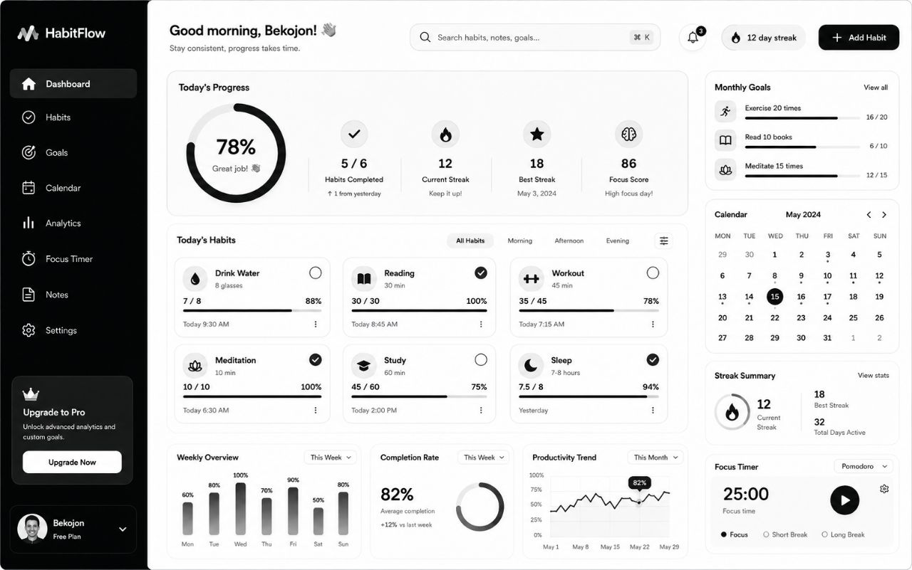
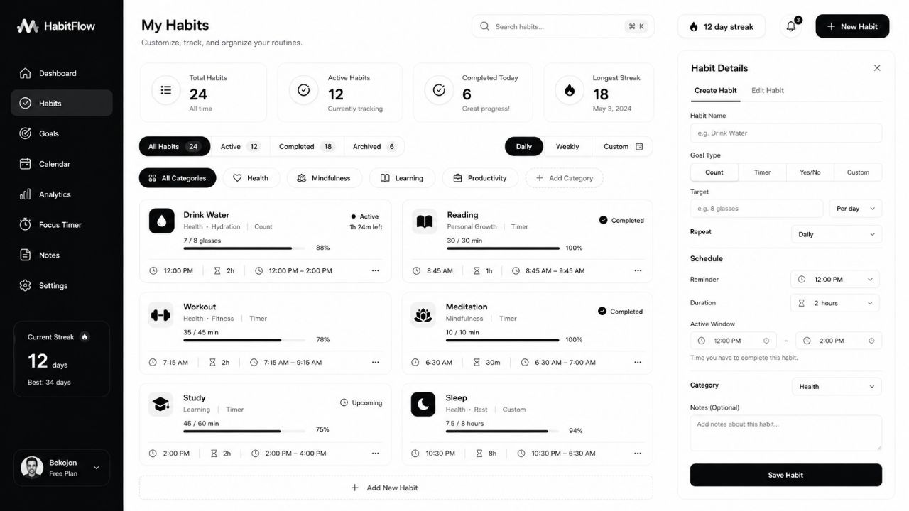
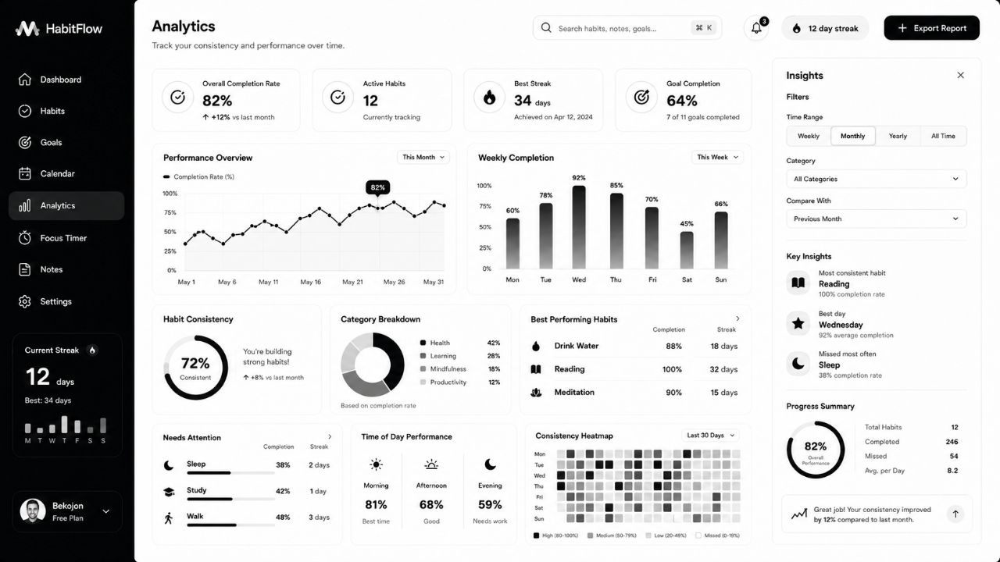

<p align="center">
  
</p>

<h1 align="center">⚡ HabitFlow</h1>

<p align="center">
  <b>A premium black-and-white habit tracker web app designed for focus, consistency, goals, notes, analytics, and daily self-improvement.</b>
</p>

<p align="center">
  <a href="#-overview">Overview</a> •
  <a href="#-features">Features</a> •
  <a href="#-pages">Pages</a> •
  <a href="#-tech-stack">Tech Stack</a> •
  <a href="#-installation">Installation</a> •
  <a href="#-roadmap">Roadmap</a>
</p>

<p align="center">
  
  
  
  
</p>

---

## ✨ Overview

**HabitFlow** is a modern, premium-style habit tracker web application built for people who want to stay consistent, organize routines, track long-term goals, write daily notes, analyze progress, and improve focus.

The project is designed with a clean **black-and-white SaaS dashboard style**, inspired by professional productivity dashboards. It focuses on clarity, structure, and usability instead of cluttered colors or unnecessary distractions.

HabitFlow is not just a basic todo list. It combines multiple productivity systems into one unified interface:

- habit tracking
- goal management
- calendar planning
- analytics dashboard
- focus timer
- note-taking system
- customizable settings
- local data persistence

The goal of this project is to create a personal productivity dashboard that feels polished, fast, useful, and visually premium.

---

## 🖼️ Preview

> Add your own screenshots here after uploading them into the repository.

<p align="center">
  
</p>

<p align="center">
  
  
</p>

---

## 🎯 Project Purpose

The purpose of HabitFlow is to help users build consistency through a visually clear and functional habit system.

Many habit apps are either too simple or too overloaded. HabitFlow tries to stay in the middle:

- simple enough to understand quickly
- powerful enough to track real progress
- clean enough to use every day
- customizable enough for different routines

This project was also created as a frontend product design experiment: building a dashboard that looks close to a real SaaS application while still being lightweight and easy to run locally.

---

## 🚀 Features

### ✅ Habit Tracking

HabitFlow allows users to create, edit, track, and complete daily habits.

Each habit can include:

- habit name
- category
- icon
- goal type
- target value
- progress value
- reminder time
- duration
- active time window
- notes
- status

Example:

```txt
Habit: Drink Water
Reminder: 12:00 PM
Duration: 2 hours
Active Window: 12:00 PM – 2:00 PM
Target: 8 glasses
Progress: 7 / 8
```

The habit system is designed to feel more complete than a simple checklist. Every habit can have a schedule and a measurable progress value.

---

### ⏰ Reminder + Duration System

A habit can have both:

```txt
Reminder Time
Duration
```

This makes it possible to calculate an active window automatically.

For example:

```txt
Reminder: 12:00 PM
Duration: 2 hours
Active Window: 12:00 PM – 2:00 PM
```

This is useful when the user does not only want to know *what* to do, but also *when* to do it and how long they have to complete it.

---

### 🎯 Goal Management

The goals page is made for long-term progress tracking.

Goal cards include:

- goal title
- category
- current value
- target value
- progress bar
- deadline
- reminder
- status
- milestone buttons

Supported example goals:

```txt
Read 12 Books
Workout 60 Times
Save $5,000
Meditate 100 Sessions
Launch Portfolio
Sleep Before 11 PM 20 Days
```

Each goal is visual, measurable, and easy to update.

---

### 📅 Calendar Planning

HabitFlow includes a calendar-style view for planning and reviewing consistency.

Calendar features:

- month grid
- selected day highlight
- habit completion dots
- day details panel
- daily habit status
- daily notes
- weekly summary cards

The calendar gives a bigger picture of habit consistency over time.

---

### 📊 Analytics Dashboard

The analytics page shows progress in a more visual way.

Analytics includes:

- overall completion rate
- active habits
- best streak
- goal completion rate
- performance overview
- weekly completion
- habit consistency
- category breakdown
- best performing habits
- habits that need attention
- time-of-day performance
- consistency heatmap
- insights panel

This page is meant to help users understand their behavior instead of just checking off tasks.

---

### ⏱️ Focus Timer

HabitFlow includes a Pomodoro-style focus timer.

Focus timer features:

- Focus mode
- Short Break mode
- Long Break mode
- play / pause
- reset
- session history
- focus goals
- daily focus progress
- simple progress visualization

The focus timer helps the user connect habits with actual deep work sessions.

---

### 📝 Notes System

The notes page is built for reflections, planning, ideas, and habit-related thoughts.

Notes include:

- title
- category
- tags
- content
- pinned state
- last edited time
- note cards
- note editor
- local saving

Example notes:

```txt
Daily Reflection
Workout Plan
Video Ideas
Reading Notes
Goal Breakdown
Quick Thoughts
```

This makes HabitFlow more than a tracker — it becomes a personal productivity workspace.

---

### ⚙️ Settings

The settings page includes customizable app preferences.

Settings sections:

1. Account
2. Preferences
3. Notifications
4. Habit Settings
5. Focus Timer Settings
6. Calendar & Notes
7. Privacy & Data
8. App Info / Support

Available settings:

- light theme
- dark theme
- system theme
- colorful theme
- habit reminders
- goal reminders
- daily summary
- focus timer alerts
- sound effects
- weekend tracking
- auto-save notes
- sync data toggle
- export data
- reset data

---

## 🧭 Pages

HabitFlow currently includes the following main pages:

```txt
Dashboard
Habits
Goals
Calendar
Analytics
Focus Timer
Notes
Settings
```

Each page has a unique layout and purpose.

---

## 🖥️ Dashboard

The dashboard is the central overview of the app.

It includes:

- Today’s Progress
- circular progress ring
- habit completion stats
- current streak
- best streak
- focus score
- today’s habits
- monthly goals
- mini calendar
- streak summary
- focus timer card
- weekly overview
- completion rate
- productivity trend

The dashboard is built to show the most important information quickly without overwhelming the user.

---

## ✅ Habits Page

The habits page is where users manage their routines.

It includes:

- habit stats
- filters
- category buttons
- habit cards
- progress bars
- active window information
- reminder and duration
- habit details panel
- create/edit habit form

This page is designed to make habit customization easy and clear.

---

## 🎯 Goals Page

The goals page focuses on long-term progress.

It includes:

- goal stats
- goal filters
- goal categories
- progress cards
- milestone buttons
- goal details panel

This helps users separate daily actions from bigger long-term targets.

---

## 📅 Calendar Page

The calendar page gives a timeline-based view of progress.

It includes:

- month calendar
- day selection
- completion dots
- day details
- daily notes
- completion summary cards

This page is useful for reviewing consistency over days and weeks.

---

## 📊 Analytics Page

The analytics page turns activity into insight.

It includes:

- completion rate
- streak information
- weekly charts
- heatmap
- category breakdown
- best habits
- weak habits
- insights panel

The purpose of this page is to help users understand patterns in their behavior.

---

## ⏱️ Focus Timer Page

The focus timer page helps with deep work.

It includes:

- timer ring
- focus/break modes
- play/pause/reset
- session history
- daily focus progress
- focus goals

This is useful for studying, coding, designing, reading, or any task that requires concentration.

---

## 📝 Notes Page

The notes page adds a personal workspace to the app.

It includes:

- note cards
- note editor
- categories
- tags
- pinned notes
- auto-save behavior

This can be used for daily journaling, planning, reflections, or productivity notes.

---

## ⚙️ Settings Page

The settings page gives users control over the app experience.

It includes:

- appearance settings
- notification toggles
- habit defaults
- focus timer settings
- calendar and notes settings
- data export
- privacy information

---

## 🧠 Design Philosophy

HabitFlow follows a simple design principle:

> The interface should feel calm, structured, and premium — not noisy.

The visual style is based on:

- black sidebar
- white cards
- soft gray background
- rounded corners
- minimal icons
- clean typography
- subtle borders
- dashboard-style layouts
- compact spacing
- strong visual hierarchy

The design avoids excessive colors so users can focus on progress rather than decoration.

---

## 🎨 Visual Style

```txt
Primary Background: #f5f6fa
Card Background: #ffffff
Primary Text: #050505
Muted Text: #6f7380
Border Color: #e3e6ee
Primary Action: #050505
Sidebar: #050607
```

Main UI characteristics:

- 18–24px border radius
- black primary buttons
- white cards
- soft shadows
- clean grid layouts
- compact desktop-first interface

---

## 🧩 Tech Stack

HabitFlow is built with:

```txt
React
Vite
JavaScript
CSS
localStorage
```

No backend is required in the current version.

---

## 📦 Installation

Clone the repository:

```bash
git clone https://github.com/your-username/habitflow.git
```

Go into the project folder:

```bash
cd habitflow
```

Install dependencies:

```bash
npm install
```

Run the development server:

```bash
npm run dev
```

Open in browser:

```txt
http://localhost:5173
```

---

## 🛠️ Available Scripts

```bash
npm run dev
```

Starts the local development server.

```bash
npm run build
```

Builds the project for production.

```bash
npm run preview
```

Previews the production build locally.

---

## 📁 Project Structure

```txt
habitflow/
│
├── public/
│
├── src/
│   ├── App.jsx
│   ├── App.css
│   ├── main.jsx
│   └── index.css
│
├── index.html
├── package.json
├── vite.config.js
└── README.md
```

---

## 💾 Data Storage

HabitFlow currently uses browser `localStorage`.

This means:

- data is saved in the browser
- changes remain after refresh
- no account is required
- no backend is needed
- data stays local to the device

Stored data includes:

```txt
habits
goals
notes
settings
focus sessions
theme preference
progress data
```

---

## 🔐 Privacy

HabitFlow does not send user data to a server in the current version.

All information is stored locally in the browser.

This makes the project simple, fast, and privacy-friendly.

---

## 🧪 Current Status

The project is currently a frontend prototype / local productivity dashboard.

Working features include:

- page navigation
- habit cards
- goal cards
- notes editor
- focus timer
- settings toggles
- theme switching
- localStorage persistence
- progress updates
- calendar interactions

---

## 🧱 Future Improvements

Planned features:

- real authentication
- cloud database
- user accounts
- real reminder notifications
- mobile app version
- drag-and-drop habit ordering
- advanced statistics
- weekly/monthly reports
- streak protection
- custom icons
- custom categories
- calendar sync
- export/import backup
- PWA support
- offline mode
- animations
- keyboard shortcuts

---

## 🗺️ Roadmap

### Phase 1 — Frontend Prototype

- [x] Dashboard UI
- [x] Habit page
- [x] Goals page
- [x] Calendar page
- [x] Analytics page
- [x] Focus timer
- [x] Notes page
- [x] Settings page
- [x] localStorage saving

### Phase 2 — Better Interactions

- [ ] Drag and drop habits
- [ ] Real notification reminders
- [ ] Better search and filters
- [ ] Calendar event creation
- [ ] Advanced note formatting
- [ ] Improved analytics charts

### Phase 3 — Full Product

- [ ] Backend API
- [ ] Database
- [ ] User authentication
- [ ] Cloud sync
- [ ] Public deployment
- [ ] PWA support
- [ ] Mobile responsive redesign

---

## 🧑‍💻 Why I Built This

HabitFlow was created as a personal productivity and UI/UX project.

The idea was to build something that feels like a real premium SaaS dashboard, while still being useful as a habit tracker. Instead of making a simple checklist, this project combines multiple systems into one app:

```txt
habits + goals + calendar + analytics + focus + notes
```

The result is a productivity dashboard that can be expanded into a real full-stack application in the future.

---

## 🌟 What Makes HabitFlow Different?

Most habit trackers are either too basic or too complicated.

HabitFlow tries to be:

- visual but not distracting
- detailed but not confusing
- structured but still flexible
- minimal but not empty
- personal but still professional

The black-and-white design gives it a premium dashboard look, while the internal pages make it more complete than a regular habit checklist.

---

## 📌 Important Notes

This project currently does **not** include:

```txt
subscriptions
pricing
free plan
pro plan
upgrade system
locked features
```

All features are intended to be available inside the app.

---

## 🚀 Deployment

You can deploy HabitFlow on:

- Vercel
- Netlify
- GitHub Pages
- Cloudflare Pages

### Deploy with Vercel

Install Vercel CLI:

```bash
npm install -g vercel
```

Deploy:

```bash
vercel
```

Or connect your GitHub repository directly to Vercel.

---

## 🖤 Branding

Project name:

```txt
HabitFlow
```

Tagline ideas:

```txt
Build consistency. Track progress. Stay focused.
```

```txt
A premium dashboard for habits, goals, focus, and daily growth.
```

```txt
Your personal command center for self-improvement.
```

---

## 🤝 Contributing

Contributions are welcome.

You can contribute by:

- improving UI
- fixing bugs
- adding new features
- optimizing responsiveness
- improving accessibility
- adding animations
- improving localStorage structure
- creating backend support

Steps:

```bash
fork the repository
create a new branch
make your changes
open a pull request
```

---

## 📄 License

This project is open source and available under the MIT License.

You can use, modify, and improve it freely.

---

## 👤 Author

Created by **Bekojon**

```txt
Content Creator
Web Developer
Designer
```

Portfolio:

```txt
https://bekojon.vercel.app
```

GitHub:

```txt
https://github.com/bekojon
```

YouTube:

```txt
https://youtube.com/@bekojonuz
```

---

## ⭐ Support

If you like this project, consider giving it a star on GitHub.

It helps the project grow and motivates future improvements.

<p align="center">
  <b>HabitFlow — Build better habits with clarity, focus, and consistency.</b>
</p>

<p align="center">
  
</p>
