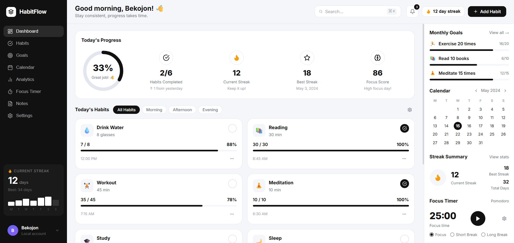
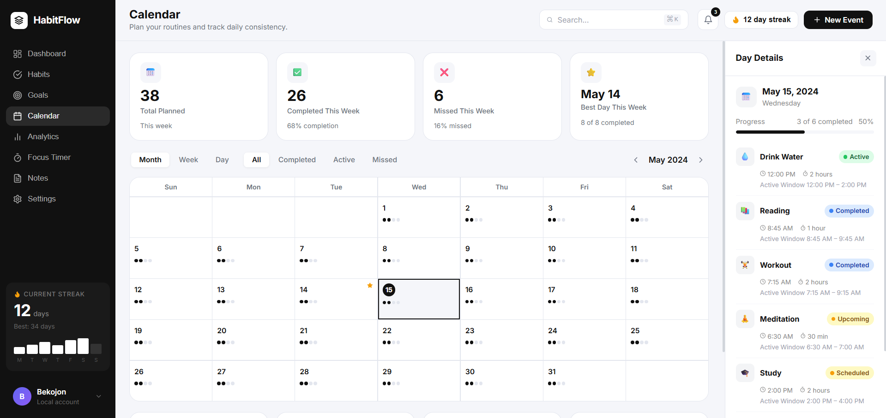
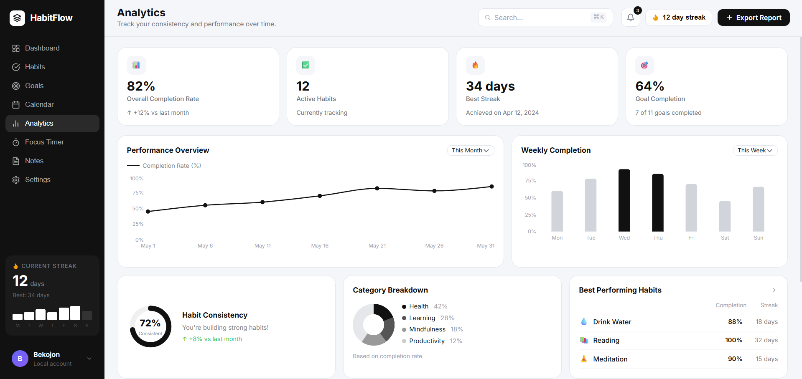
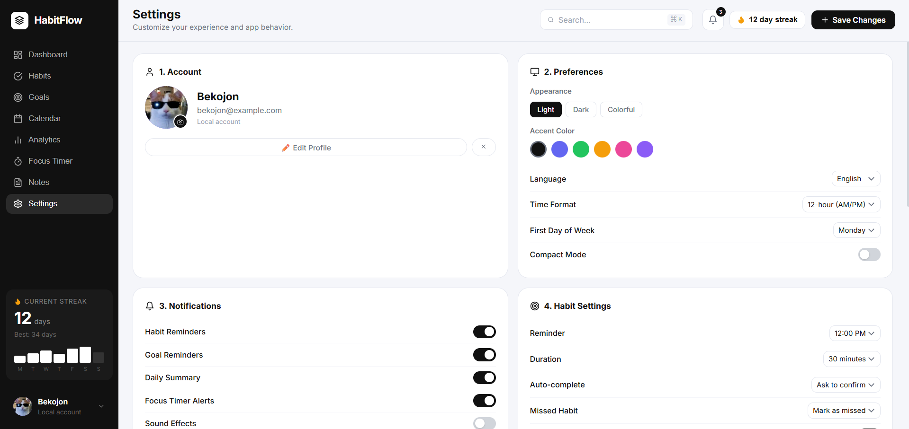

<p align="center">
  
</p>

<h1 align="center">⚡ HabitFlow</h1>

<p align="center">
  <b>A premium black-and-white habit tracker web app designed for focus, consistency, goals, notes, analytics, and daily self-improvement.</b>
</p>

<p align="center">
  <a href="#-overview">Overview</a> •
  <a href="#-preview">Preview</a> •
  <a href="#-features">Features</a> •
  <a href="#-installation">Installation</a> •
  <a href="#-socials">Socials</a>
</p>

<p align="center">
  
  
  
  
</p>

---

## ✨ Overview

**HabitFlow** is a modern PC web app made for tracking habits, goals, focus sessions, notes, and daily progress in one clean dashboard.

It is built with a premium black-and-white UI style, rounded cards, a dark sidebar, analytics sections, calendar planning, customizable habit management, and a focus timer with a relaxing Spotify player experience.

The main goal of this project is to help users stay consistent, organize their daily routine, improve learning habits, and make self-improvement easier through a simple but powerful dashboard.

---

## 🖼️ Preview

> Place these images inside a `screenshots` folder with the exact file names below.

<p align="center">
  
</p>

<p align="center">
  
  
</p>

<p align="center">
  
  
</p>

---

## 🚀 Features

- ✅ Customizable habits
- ✅ Habit reminder time
- ✅ Habit duration / active window
- ✅ Goals tracker
- ✅ Calendar view
- ✅ Analytics dashboard
- ✅ Focus timer
- ✅ Relaxing Spotify player inside the Focus Timer section
- ✅ Notes system
- ✅ Settings page
- ✅ Light / Dark / System / Colorful theme
- ✅ Local data saving with `localStorage`
- ✅ Desktop-first premium UI

---

## 🎧 Focus Timer + Spotify Player

HabitFlow includes a focus timer section designed for deep work and study sessions.

The Focus Timer includes:

- Focus / Short Break / Long Break modes
- Start, pause, reset, and skip controls
- Session history
- Daily focus progress
- Focus goals
- A Spotify player area for relaxing music while studying or working

This makes the focus section feel more complete, because users can open the timer and listen to calm music without leaving the productivity workspace.

---

## 📌 Main Sections

HabitFlow includes these sections:

```txt
Dashboard
Habits
Goals
Calendar
Analytics
Focus Timer
Notes
Settings
```

---

## 🧩 Tech Stack

```txt
React
Vite
JavaScript
CSS
localStorage
```

---

## 📦 Installation

Clone the repository:

```bash
git clone https://github.com/Bekojon/HabitFlow.git
```

Go to the project folder:

```bash
cd HabitFlow
```

Install dependencies:

```bash
npm install
```

Run the project:

```bash
npm run dev
```

Open in browser:

```txt
http://localhost:5173
```

---

## 🛠️ Available Scripts

Start development server:

```bash
npm run dev
```

Build for production:

```bash
npm run build
```

Preview production build:

```bash
npm run preview
```

---

## 📁 Project Structure

```txt
HabitFlow/
│
├── screenshots/
│   ├── dashboard.png
│   ├── calendar.png
│   ├── analytics.png
│   ├── focus timer.png
│   └── settings.png
│
├── src/
│   ├── App.jsx
│   ├── App.css
│   ├── main.jsx
│   └── index.css
│
├── index.html
├── package.json
├── vite.config.js
└── README.md
```

---

## 💾 Data Storage

HabitFlow currently uses browser `localStorage`.

This means:

- data is saved locally
- progress stays after refresh
- no backend is required
- no account is required

Saved data includes:

```txt
habits
goals
notes
settings
focus sessions
theme preference
progress data
```

---

## ⚠️ Note

This is the first version of the project, so there may be small issues or unfinished parts.

The app is currently optimized mainly for **PC / desktop** screens.

---

## 🌐 Socials

<p align="left">
  <a href="https://youtube.com/@BekojonUZ">
    
  </a>
</p>

<p align="left">
  <a href="https://instagram.com/uztiers">
    
  </a>
</p>

<p align="left">
  
</p>

---

## 👤 Author

Created by **Bekojon**

```txt
Content Creator
Web Developer
Designer
```

---

## ⭐ Support

If you like this project, consider giving it a star on GitHub.

<p align="center">
  <b>HabitFlow — Build consistency. Track progress. Stay focused.</b>
</p>

<p align="center">
  
</p>
